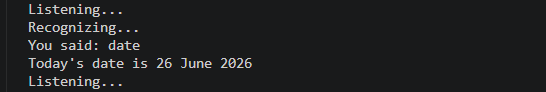
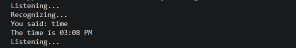
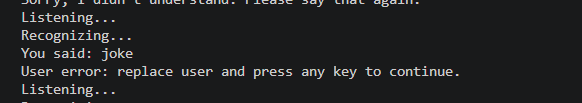

# 🤖 AI Virtual Assistant

A Python-based AI Virtual Assistant that performs various voice-controlled tasks such as opening websites, searching Google and Wikipedia, telling the current date and time, and telling jokes. The assistant uses Speech Recognition and Text-to-Speech technologies to interact with the user naturally.

---

## 📌 Overview

The AI Virtual Assistant is designed to simplify everyday computer tasks using voice commands. It listens to user input through a microphone, processes the command, and performs the requested action. This project demonstrates the integration of speech recognition, automation, and Python libraries to create an intelligent desktop assistant.

---

## ✨ Features

* 🎤 Voice Command Recognition
* 🔊 Text-to-Speech Response
* 🌐 Open Google
* 📧 Open Gmail
* ▶️ Open YouTube
* 📚 Search Wikipedia
* 🔍 Perform Google Searches
* 📅 Tell Current Date
* ⏰ Tell Current Time
* 😂 Tell Random Jokes
* 💻 Launch Applications
* 🤖 Simple AI-based Command Processing

---

## 🛠 Technologies Used

* Python
* SpeechRecognition
* pyttsx3
* Wikipedia
* pyjokes
* datetime
* webbrowser
* os
* pyautogui

---

## 📂 Project Structure

```text
AI-Virtual-Assistant/
│
├── screenshots/
│   ├── date.png
│   ├── joke.png
│   ├── open gmail.png
│   ├── open google.png
│   ├── open youtube.png
│   ├── search and wikipedia.png
│   └── time.png
│
├── main.py
├── requirements.txt
├── README.md
├── .gitignore
└── .vscode/
```

---

## ⚙ Installation

### 1. Clone the repository

```bash
git clone https://github.com/b23cn082/Ai-Virtual-Assistant.git
```

### 2. Navigate to the project folder

```bash
cd Ai-Virtual-Assistant
```

### 3. Install the required libraries

```bash
pip install -r requirements.txt
```

### 4. Run the project

```bash
python main.py
```

---

## 🚀 Usage

1. Run the Python program.
2. Speak your command through the microphone.
3. The assistant recognizes your speech.
4. It executes the requested task.
5. The assistant responds using voice output.

---

## 📸 Project Output Screenshots

### 📅 Date



---

### ⏰ Time



---

### 🌐 Open Google


---

### 📧 Open Gmail


---

### ▶️ Open YouTube


---

### 🔍 Search & Wikipedia


---

### 😂 Joke



---

## 📈 Future Enhancements

* ChatGPT Integration
* Weather Forecast
* Email Sending
* WhatsApp Automation
* Face Recognition
* Voice Authentication
* Smart Home Device Control
* AI Conversation Support

---

## 📋 Requirements

Install the following Python packages:

* SpeechRecognition
* pyttsx3
* wikipedia
* pyjokes
* pyaudio

You can install all dependencies using:

```bash
pip install -r requirements.txt
```

---

## 🎯 Learning Outcomes

This project demonstrates:

* Python Programming
* Speech Recognition
* Text-to-Speech Conversion
* Desktop Automation
* API Integration
* Voice-Based User Interaction
* File Handling
* Python Package Management

---

## 👩‍💻 Author

**Priyanka Gurrapu**

GitHub: https://github.com/b23cn082

---

## ⭐ If you like this project

Please consider giving this repository a ⭐ on GitHub.

---

## 📜 License

This project is licensed under the MIT License.
